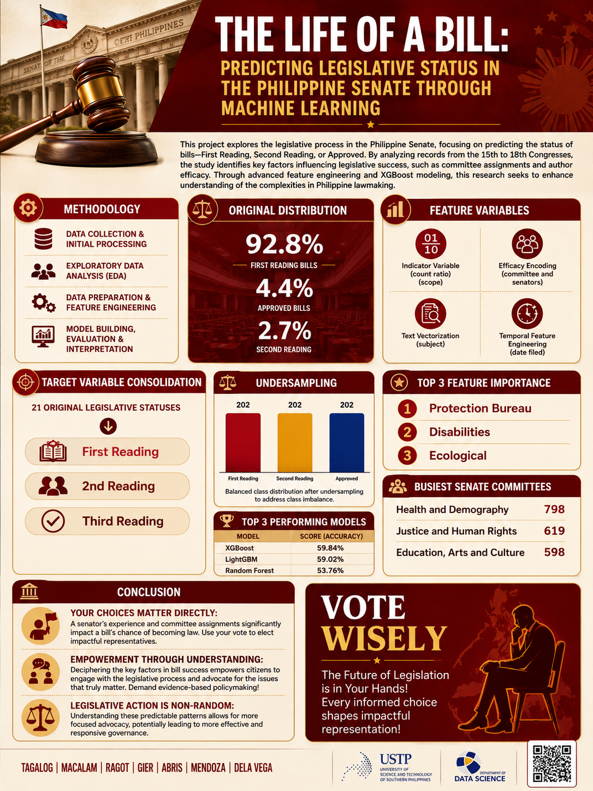

# The Life of a Bill

## Predicting Legislative Status in the Philippine Senate Through Machine Learning

This project studies what happens to bills filed in the Philippine Senate. It uses machine learning to look for patterns that may help predict whether a bill will:

- stay at **First Reading**
- move to **Second Reading**
- become **Approved**

In simple terms, the project asks:

> Can the early details of a Senate bill help us understand its possible future?

## Why This Matters

Every Congress, many bills are filed, but only a small number become approved laws. This project helps show that lawmaking is not random. Factors such as committee assignment, author history, bill scope, filing timing, and policy subject can all influence a bill's progress.

The goal is not to judge whether a bill is good or bad. The goal is to use data to better understand the legislative process.

## Dataset

The data came from the official Philippine Senate Legislative Document Room (LDR). The project covers the 15th to 18th Congresses.

| Congress | Number of Bills |
|---|---:|
| 15th Congress | 2,242 |
| 16th Congress | 2,067 |
| 17th Congress | 1,447 |
| 18th Congress | 1,750 |
| **Total scraped bills** | **7,506** |

After cleaning the data, 7,352 bills were used for analysis.

## What the Project Found

The biggest finding is that most bills do not move very far in the process.

| Final Status | Share of Bills |
|---|---:|
| First Reading | 92.8% |
| Second Reading | 2.75% |
| Approved | 4.45% |

This means around 93 out of every 100 bills stayed at the First Reading stage.

Other findings:

- Filing many bills does not automatically mean a senator gets many bills approved.
- Some committees receive very large workloads, which can create bottlenecks.
- Committee assignment is one of the strongest signals in predicting bill progress.
- The subject or policy area of a bill also gives useful clues.
- A machine learning model can find patterns, but it should not replace human judgment.

## How the Machine Learning Works

The project follows these steps:

1. Collect Senate bill data using a web scraper.
2. Clean and combine the datasets from four Congresses.
3. Group many detailed legislative statuses into three easier categories.
4. Create useful features from the data, such as author history, committee history, bill scope, filing date, and subject keywords.
5. Train and compare several machine learning models.
6. Choose the best model and explain which factors influenced its predictions.

The final selected model is **XGBoost**, a machine learning model that is good at finding patterns in structured data.

## Important Note

The final model is useful for analysis and learning, but it is not perfect. It should not be used as an automatic decision-maker for politics, law, or public policy.

The model is best understood as a tool for showing patterns in historical Senate data.

## Project Files

| File | Purpose |
|---|---|
| `Technical_Report.ipynb` | Main notebook with the full analysis, visualizations, model training, and results |
| `webscraper.ipynb` | Notebook used to collect bill data from the Senate LDR website |
| `ldr_senate_bills_15th_congress.csv` | Dataset for the 15th Congress |
| `ldr_senate_bills_16th_congress.csv` | Dataset for the 16th Congress |
| `ldr_senate_bills_17th_congress.csv` | Dataset for the 17th Congress |
| `ldr_senate_bills_18th_congress.csv` | Dataset for the 18th Congress |
| `Group 3 Presentation (2)-compressed.pdf` | Presentation slides for the project |
| `PUBMAT.png` | Publication material / project infographic |

## How to View the Project

Start with:

1. Try the deployed interactive model.
2. Read this README.
3. Review `PUBMAT.png` and `Group 3 Presentation (2)-compressed.pdf`.

For a technical reader, open `Technical_Report.ipynb` in Jupyter Notebook, JupyterLab, or Google Colab.

## Interactive Model

The Streamlit app loads a pre-trained XGBoost artifact and lets visitors evaluate
historical bill scenarios. It reports probabilities for First Reading, Second
Reading, and Approved, together with the model's holdout evaluation context.

This is an educational historical-pattern prototype. It is not legal, political,
investment, or public-policy advice.

### Run locally

```bash
pip install -r requirements.txt
streamlit run app.py
```

### Rebuild the model artifact

```bash
python train_model.py
```

## Authors

- Tagalog
- Macalam
- Ragot
- Gier
- Abris
- Mendoza
- Dela Vega

## Pubmat


